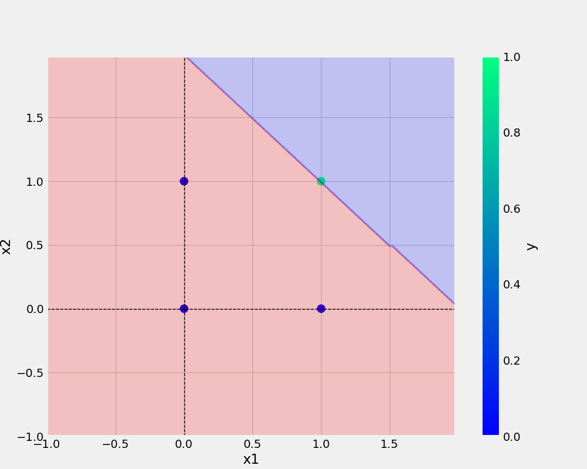

# oneNeuron

## Add url -

[sample path](url-path)

## Add image -




### Code

``` bash
def main(data, modelName, plotName, eta, epochs):
    df = pd.DataFrame(data) 
    logging.info(df)
    X, y = prepare_data(df)
    model = Perceptron(eta=ETA, epochs=EPOCHS)
    model.fit(X, y)
    _ = model.total_loss()
    save_model(model, filename=modelName)
    save_plot(df, plotName, model)
```

## Dataset

x1 |x2 |y
-|-|-|
0|0|0
0|1|0
1|0|0
1|1|1